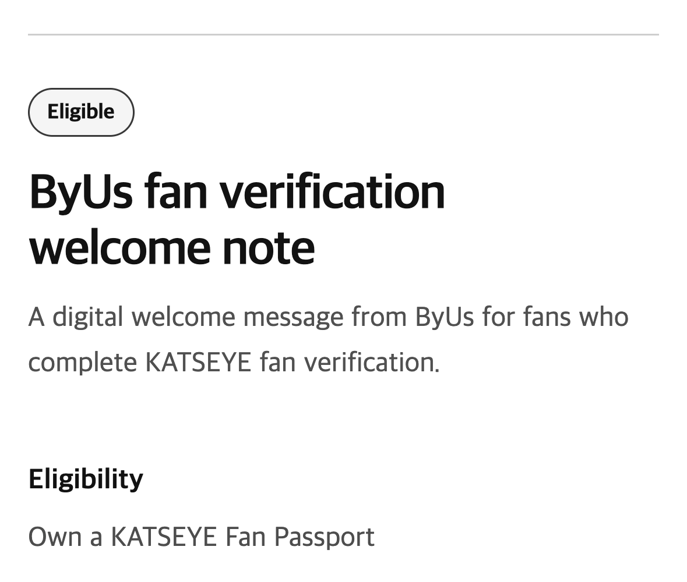
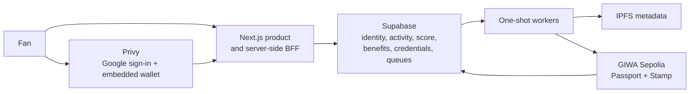

<p align="center">
  <a href="https://byus.kr/?locale=en">
    
  </a>
</p>

<h1 align="center">Turn fan participation into lasting value.</h1>

<p align="center">
  ByUs is a fan-commerce platform that connects verified fandom, LIVE participation,
  portable credentials, and real benefits in one consumer journey.
</p>

<p align="center">
  <a href="https://byus.kr/?locale=en"></a>
  <a href="https://github.com/ByUs-FanPassport/ByUs---GitBook"></a>
  <a href="https://docs.giwa.io/giwa-chain/en/"></a>
  <a href="https://github.com/ByUs-FanPassport/ByUs/actions/workflows/dependency-audit.yml"></a>
</p>

## What ByUs does

Fan activity is valuable, but it is usually fragmented across content, community, LIVE, and commerce platforms. ByUs turns verified participation into a persistent fan record:

1. **Discover** a favorite creator and an upcoming LIVE.
2. **Sign in** with Google while an embedded EVM wallet is provisioned in the background.
3. **Verify** fandom through a creator-specific quiz.
4. **Collect** a soulbound Fan Passport and participation Stamps.
5. **Grow** Fan Score through reservations, attendance, and surveys.
6. **Unlock** benefits based on verified activity—not follower count.

| Discover and participate | Verify and unlock |
| --- | --- |
|  |  |
|  |  |

## Product architecture

ByUs is database-first. Supabase remains the operational source of truth for identity, activity, score, eligibility, claims, and mint state. GIWA provides the public ownership and verification layer for issued credentials.



### Technology

| Layer | Implementation |
| --- | --- |
| Product | Next.js 16, React 19, TypeScript |
| Identity and wallet | Privy embedded EVM wallet |
| Data and queues | Supabase Postgres, RLS, RPCs, Edge Functions |
| Chain integration | Viem, GIWA Sepolia |
| Credentials | Soulbound ERC-721 Passport and ERC-1155 Stamp |
| Metadata | IPFS |
| Workers | One-shot TypeScript workers on AWS Lambda |
| Contracts | Solidity 0.8.28, Foundry, OpenZeppelin Contracts |

## Fan Passport and Live Stamps

### Fan Passport

Each Passport belongs to one fan in one creator context. It brings together:

- verified fan identity;
- Fan Score and level progress;
- Knowledge, Reservation, Attendance, and Survey Stamps;
- recent participation;
- available benefits;
- GIWA token and transaction proof after minting.

### Live Stamps

| Activity | Credential | Fan Score |
| --- | --- | ---: |
| Pass fan verification | Knowledge Stamp | `+1` |
| Reserve a LIVE | Reservation Stamp | `+1` |
| Enter the LIVE Fan Code | Attendance Stamp | `+3` |
| Complete the post-LIVE survey | Survey Stamp | `+2` |

Both credential contracts are non-transferable. A fan can prove the record, but cannot sell or transfer it to another wallet.

## Verified on GIWA Sepolia

| Credential | Contract | Standard |
| --- | --- | --- |
| Fan Passport | [`0x17f9…ca20`](https://sepolia-explorer.giwa.io/address/0x17f9FB7658A326DD88dB523739c227faf50Fca20) | Soulbound ERC-721 |
| Live Stamp | [`0x1AdC…2285`](https://sepolia-explorer.giwa.io/address/0x1AdCdE3473c4e884E60205b397ecE744D8892285) | Soulbound ERC-1155 |

- [Successful Passport mint](https://sepolia-explorer.giwa.io/tx/0x7574bdeb18ca5ecfcffcbc581cad353e9bfdff69d7f3c792d3add471f54c504e)
- [Successful Stamp mint](https://sepolia-explorer.giwa.io/tx/0x4c3bcf6e47388b30c289bf83c468f67fb2047799b47e31b5181e83c44c5ef627)
- [Standalone contract repository](https://github.com/ByUs-FanPassport/ByUs-Contracts)

> The current deployment is on GIWA Sepolia testnet. ByUs does not put private fan profiles, quiz answers, activity logs, CRM data, or benefit fulfillment data on-chain.

## Repository map

```text
apps/web              Production fan product, BFF, and operations UI
apps/worker           Passport/Stamp minting and notification workers
contracts             Soulbound credential contracts and Foundry tests
supabase/migrations   Product domain, queues, owner projections, and invariants
supabase/functions    Protected scheduler and queue-maintenance functions
infrastructure/aws    Worker runtime infrastructure
scripts               Build, security, media, deployment, and verification tools
```

`apps/web` is the production application. `apps/fan-web` is a local design workbench and is not part of the production runtime.

## Quick start

### Requirements

- Node.js `24.13.1`
- npm `11.18.0`
- Maintainer-approved development values for Privy, Supabase, and GIWA

```bash
git clone https://github.com/ByUs-FanPassport/ByUs.git
cd ByUs
npm ci

cp apps/web/.env.example apps/web/.env.local
# Fill apps/web/.env.local with authorized development values.

npm run dev --workspace @byus/web
```

Open [http://localhost:3000](http://localhost:3000).

### Quality checks

```bash
npm run test:web
npm run typecheck
npm run lint:web
npm run build

npm test --workspace @byus/worker
npm run typecheck --workspace @byus/worker
npm run build --workspace @byus/worker

cd contracts
forge test
```

The full environment model, worker lifecycle, and verification commands are documented in the [ByUs Developer Documentation](https://github.com/ByUs-FanPassport/ByUs---GitBook).

## Security and privacy

- Protected product requests are verified by the server-side BFF.
- Browser roles do not receive direct access to private operational tables.
- Passport and Stamp metadata excludes email, nickname, real name, phone number, wallet recipient, and internal entity identifiers.
- Business state is committed before asynchronous minting.
- Mint jobs are leased, idempotent, and reconciled against receipts and contract events.
- Relayer, Supabase service-role, and IPFS credentials belong only in server or worker environments.

Please read [SECURITY.md](SECURITY.md) before reporting a vulnerability.

## Documentation

- [Developer documentation source](https://github.com/ByUs-FanPassport/ByUs---GitBook)
- [Product journey](https://github.com/ByUs-FanPassport/ByUs---GitBook/blob/main/getting-started/product-journey.md)
- [Architecture overview](https://github.com/ByUs-FanPassport/ByUs---GitBook/blob/main/architecture/overview.md)
- [GIWA network and contracts](https://github.com/ByUs-FanPassport/ByUs---GitBook/blob/main/giwa/network-and-contracts.md)
- [ByUs Contracts](https://github.com/ByUs-FanPassport/ByUs-Contracts)

## License

The application source is publicly viewable for evaluation and collaboration. Copyright © 2026 SallyLab Inc. All rights reserved. See [LICENSE](LICENSE).
