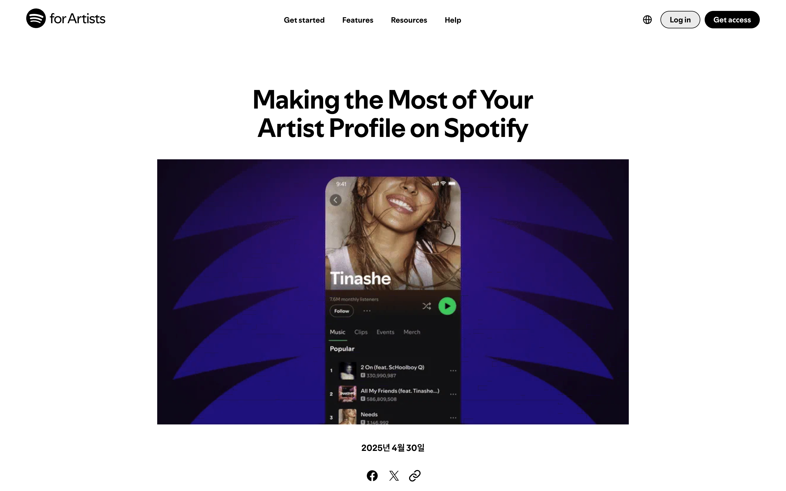
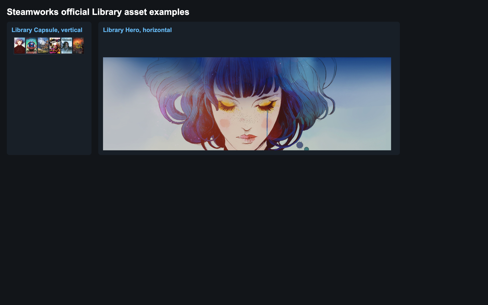
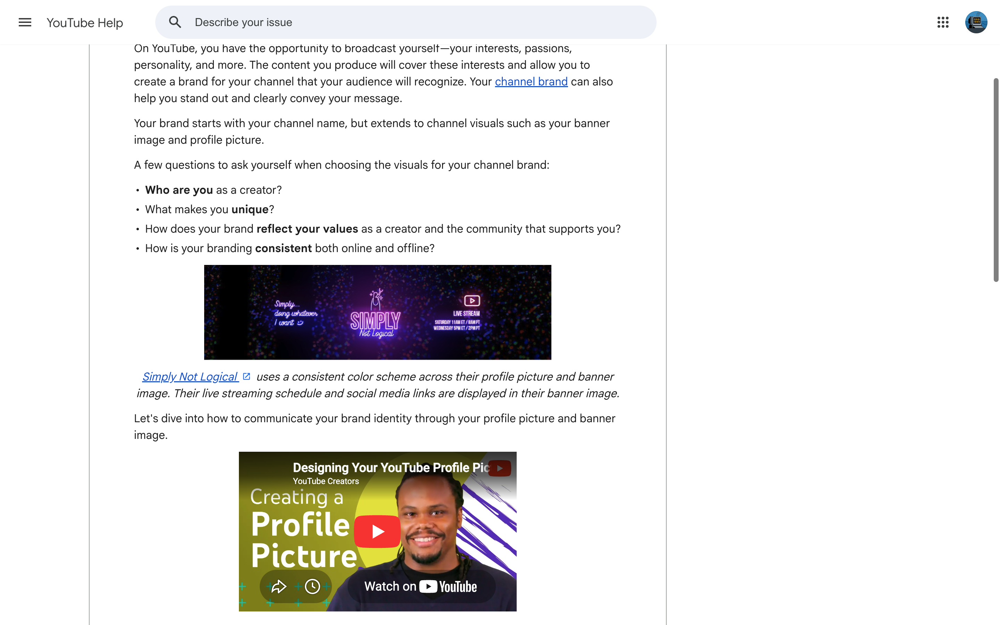

# 레퍼런스 검토 — 프로필·세로형·가로형 사진 분리

2026-09-11 · 문서 보강 · 제품 구현/사진 교체 없음

## 1. 유지할 방향과 보강할 내용

**셀럽마다 대표 프로필·세로형·가로형 사진을 따로 등록하고, 같은 용도의 사용처끼리 공유한다.** 사용자가 확인한 이 방향을 유지한다. 세 가지 사진은 서로 달라도 된다. 같은 원본을 쓰려면 각 구도에서 충분한 해상도와 얼굴·중요 내용 보존을 확인해야 한다.

레퍼런스에서 보강할 부분은 다음 네 가지다.

1. 같은 셀럽의 이미지여도 **역할별 자산을 독립적으로 선택·교체**한다.
2. 세로/가로 방향 외에 **얼굴·그룹 멤버·글자를 보존할 영역**을 관리한다.
3. **사진이 없는 경우의 대체 표시**를 정하고, 방향이 다른 사진을 자동 확대해서 채우지 않는다.
4. **인물 사진과 글자가 포함된 홍보 포스터를 분리**한다. UI 제목·일시·CTA를 이미지에 합칠 필요가 없는 배너는 별도 텍스트로 유지한다.

## 2. 공식 레퍼런스에서 확인한 내용

### Spotify — 대표 이미지와 넓은 헤더의 역할 분리

Spotify는 avatar·header·gallery를 나누어 편집한다. 공식 설명상 avatar는 모바일 아티스트 상단과 검색 결과, header는 데스크톱·웹 플레이어 상단 등에 쓰인다. 따라서 **모바일/데스크톱에서 반드시 같은 사진을 사용해야 하는 구조가 아니다.** [공식 사용처 설명](https://support.spotify.com/us/artists/article/managing-your-artist-images-on-spotify/)

공식 최소 치수도 avatar 750×750, header 2660×1140으로 다르다. 이 숫자를 ByUs 제작 규격으로 그대로 가져오지는 않는다. [공식 이미지 가이드](https://support.spotify.com/uk/artists/article/artist-image-guidelines/)

- **ByUs에 적용:** 프로필 사진과 가로 배너 사진을 별도 등록. 서로 다른 사진이어도 같은 인물임을 쉽게 알 수 있는 분위기·시기·스타일을 권장.
- **그대로 적용하지 않음:** Spotify의 header 미등록 시 avatar 대체 규칙. ByUs에서는 현재 확인된 세로→가로 과도한 crop을 피하도록 비율 보존 fallback을 사용.
- **시각 근거의 범위:** 아래 이미지는 Spotify가 공개한 모바일 아티스트 화면 소개 이미지다. 업로드 화면이나 실제 데스크톱 헤더 비교를 직접 조작한 증거가 아니다. 역할 구분은 위 공식 문서에서 확인했다.



출처: [Spotify for Artists — Artist Profile 소개](https://artists.spotify.com/en/blog/making-the-most-of-your-artist-profile-on-spotify). 분류: **공식 제품 소개 이미지**. 현재 앱을 직접 조작한 캡처 아님.

### Steam — 세로 카드와 가로 배너를 별도 자산으로 제작

Steam은 세로 Library Capsule(600×900), 가로 Library Header(920×430), 넓은 Library Hero(3840×1240)를 각각 지정한다. 카드와 상세 상단의 역할을 분리하는 사례다. Hero의 중요 내용은 창 크기가 달라져도 보존되는 영역 안에 두도록 안내한다. [공식 Library Assets](https://partner.steamgames.com/doc/store/assets/libraryassets)

- **ByUs에 적용:** `세로형 사진`과 `가로형 사진`을 서로 다른 업로드 슬롯으로 제공. 캘린더·모바일 배너와 PC 배너·가로 카드는 각 역할에 맞는 사진을 선택.
- **추가 적용:** 가로 배너의 얼굴 위치를 정할 때 화면에 겹치는 제목/버튼 영역까지 포함해 미리보기.
- **그대로 적용하지 않음:** 게임용 해상도·로고 규칙·고정 safe-area 숫자. ByUs의 실제 화면 크기와 텍스트 위치에서 계산해야 한다.



출처: [Steamworks Library Assets](https://partner.steamgames.com/doc/store/assets/libraryassets). 분류: **공식 원본 2장을 나란히 재배치한 비교 보드**. 보드 배치·라벨은 이번 조사에서 만들었으며 Steam의 실제 UI가 아니다. 이미지 자체는 공식 [세로 카드 원본](https://shared.fastly.steamstatic.com/community_assets/images/steamworks_docs/english/library_capsule_example2.jpg)과 [가로 Hero 원본](https://shared.fastly.steamstatic.com/community_assets/images/steamworks_docs/english/Hero_example.jpg)이다.

### YouTube — 배너 전체 크기와 중요한 내용의 안전 영역을 구분

YouTube는 프로필 사진과 배너를 구분하고, 배너는 기기에 따라 보이는 부분이 달라진다고 설명한다. 최소 업로드 크기 2048×1152에서 글자·로고 안전 영역은 1235×338로 따로 제시한다. [공식 채널 브랜딩 가이드](https://support.google.com/youtube/answer/10456525?co=GENIE.Platform%3DDesktop&hl=en)

공식 문서는 프로필과 배너의 색상 계열을 맞춘 채널을 소개한다. 확보한 화면에는 배너와 그 설명이 보이며, 별도 프로필 사진의 실제 구도 비교까지 확인한 것은 아니다. **같은 사진을 쓰지 않아도 시각적 일관성을 만들 수 있다는 참고 사례**다. [공식 채널 이미지 팁](https://support.google.com/youtube/answer/12950272?hl=en)

- **ByUs에 적용:** 사진 파일 크기 검사와 실제 화면에서 얼굴·글자가 보존되는지 검사를 분리.
- **그대로 적용하지 않음:** 하나의 배너를 모든 기기에서 자르는 YouTube 방식. ByUs는 세로형·가로형을 별도로 선택하는 방향을 유지.
- **주의:** YouTube 공식 예시 화면의 과거 UI나 업로드 조작을 현재 ByUs CMS 설계로 복사하지 않는다.



출처: [YouTube Help — Channel banner & profile picture tips](https://support.google.com/youtube/answer/12950272?hl=en). 분류: **공식 도움말의 배너 예시와 설명 캡처**. 프로필 사진 자체의 비교, 현재 채널 화면·편집 UI의 직접 조작 검증 아님.

## 3. 보강한 ByUs 사진 구성

| 등록 항목 | 사진 선택 기준 | 대표 사용처 | 같은 사진 재사용 범위 |
|---|---|---|---|
| **대표 프로필** | 작은 정사각형·원형에서도 인물이 구분되는 사진 | 홈·디렉터리·원형 아바타·MY 작은 사진 | 프로필 계열 내 공유; 세로/가로 배너로 자동 전파하지 않음 |
| **세로형** | 세로 구도에서 얼굴·상반신/전신 의도가 유지되는 사진 | 모바일 인물 배너·캘린더 포토카드 | 세로 슬롯끼리 공유하되 각각 crop 확인 |
| **가로형** | 넓은 구도와 텍스트 공간을 확보할 수 있는 사진 | PC 인물 배너·가로 Passport 카드 | 가로 슬롯끼리 공유. 모바일이어도 가로 카드면 이 사진 사용 |
| **행사 가로형** | 행사·LIVE의 넓은 홍보 구도 | 홈 PC·LIVE 상세·가로 홍보 카드 | 같은 행사 내 가로형 슬롯 |
| **행사 세로형** | 모바일 홈 세로 구도에 맞춘 별도 홍보 이미지 | 홈 모바일·세로형 행사 영역 | 같은 행사 내 세로형 슬롯 |
| **정보 포스터** | 글자·일정·조건이 포함된 완성 이미지 | 가이드·상세 안내 | 원본 비율 보존. 인물 배경 이미지와 구분 |

프로필·세로·가로를 모두 새로 제출해야만 기존 셀럽을 공개할 수 있게 만드는 결정은 아니다. **기존 공개 데이터는 보존하고, 없는 역할은 명시적인 대체 표시를 사용한다.** 가로 사진이 없는데 세로 사진을 자동 cover하는 동작은 허용하지 않는 방향이다.

### 세로·가로를 화면 크기와 동일시하지 않기

`모바일 = 세로 사진`, `PC = 가로 사진`만으로 구현하면 모바일의 가로 Passport 카드에서 다시 잘못된 사진을 선택한다. 정확한 기준은 **사용처 slot → 등록 사진 role**이다. PC/모바일은 하나의 slot 안에서 표시가 바뀔 때만 분기한다.

### 원본 방향과 출력 비율 구분

- 원본은 세로 2:3·4:5, 가로 3:2·16:9 등 다양한 구도를 받을 수 있다. 전부 동일 비율로 제출하도록 강제할 필요는 없다.
- 표시용 파생본은 승인된 slot 비율로 고정한다. 인물·글자가 잘리면 crop을 승인하지 않고 비율 보존 또는 다른 사진을 선택한다.
- 방향만 맞아도 충분한 것은 아니다. 원본 16:9를 아주 넓은2.62:1 배너에 쓸 때도 얼굴/제목 영역을 확인한다.
- 대표 프로필 파생본1200×1200, 세로 제작1080×1350, 가로 제작1920×960급은 기존 문서의 **시작값 제안**으로 유지한다. 서비스별 숫자를 복사해 확정 최소값으로 만들지 않는다. 실제 최소 픽셀은 crop 후 표시 크기×DPR로 계산한다.

## 4. CMS에서 보여줄 내용 — 제안

사진 입력을 하나의 URL 필드로 끝내지 않고 다음처럼 구성한다.

| 입력 영역 | 함께 보여줄 정보 | 교체 시 영향 |
|---|---|---|
| 대표 프로필 사진 | 정사각형·원형 미리보기, 사용 화면 목록 | 프로필 계열만 갱신 |
| 세로형 사진 | 모바일 배너·세로 카드 미리보기, 얼굴 보존 영역 | 세로형을 참조하는 화면만 갱신 |
| 가로형 사진 | PC 배너·가로 카드 미리보기, 제목/버튼과 겹치는 영역 | 가로형을 참조하는 화면만 갱신 |

같은 사진을 다른 역할에 쓰는 것은 **운영자가 명시적으로 선택하고 각 역할의 구도를 승인**하는 경우에 허용한다. 파일이 같으면 저장 파일 자체는 중복 생성하지 않아도 된다. 사진이 변경되면 해당 role의 이전 crop 승인은 재검토 상태로 전환한다.

“전용 사진 없음”, “구도 확인 필요” 같은 상태는 CMS에만 표시한다. 실제 제품 화면에 작업용 표시를 추가하지 않는다. 그룹 사진은 하나의 얼굴 중심점만 쓰지 않고 보존할 멤버 전체 영역을 확인한다.

## 5. 코드에서 강제할 최소 계약 — 제안

```ts
type CreatorPhotoSet = {
  profile: AssetRef;
  portrait?: AssetRef;
  landscape?: AssetRef;
};

const sourceRoleBySlot = {
  "identity.avatar": "profile",
  "identity.square": "profile",
  "identity.hero.mobile": "portrait",
  "identity.hero.desktop": "landscape",
  "identity.vertical": "portrait",
  "identity.calendar": "portrait",
  "identity.collection.mobile": "landscape",
  "identity.collection.desktop": "landscape",
} as const;
```

소비 화면은 slot만 지정하고, 이 매핑과 승인된 자르기 정보로 실제 source를 결정한다. 표는 구현 예시이며 기존 모든 예외를 이전한 코드가 아니다. `identity.passport`처럼 작은 합성 창은 최종 role 매핑을 기존 구도와 대조해 등록한다.

검사할 계약:

- 프로필 교체가 가로·세로 사진을 변경하지 않는다.
- 세로형 교체는 이를 사용하는 slot의 파생본만 갱신한다.
- 해당 role이 없으면 다른 role을 자동 cover하지 않는다.
- 허용된 비율 보존 fallback은 사용할 수 있지만, 공개 상태를 임의로 변경하지 않는다.
- 얼굴·중요 글자 영역과 crop/overlay 영역의 충돌을 미리보기에서 확인한다.
- 기하학적 충돌은 코드로 검사하되 인물 식별·글자 의미·미감까지 자동 검사됐다고 주장하지 않는다.

## 6. 적용 순서

1. 현재 사용처 매핑에 **참조할 사진 role**을 추가한다. — 이번 문서/CSV 보강 완료.
2. CMS와 DTO에 프로필·세로·가로 입력을 추가하고, 기존 image URL을 profile로 호환한다.
3. 현재 전용 hero·calendar 자산은 일괄 삭제하지 않고 role별로 이전·검토한다.
4. 공통 renderer와 게시 검사에 slot→role 규칙·fallback을 적용한다.
5. 모바일 홈 행사 배너와 PC 인물 배너부터 로컬에서 비교 검증한다.

## 7. 확인 범위

공식 문서 원문 확인과 Aside를 통한 공식 시각 자료 확인을 수행했다. 각 서비스의 업로드·게시·편집 동작을 직접 실행하거나 사진을 변경하지 않았다. 외부 사례는 구조를 보강하는 근거이며, 해당 서비스의 규격이 ByUs의 확정 정책이 되는 것은 아니다.

기존 ByUs 상단 캡처와 원본 크기는 같은 날짜의 앞선 조사 결과를 재사용했다. 이번 보강 때문에 운영 화면을 재검사하지 않았다. 현재 코드와 제안의 구분은 [전체 문서](README.md), 이미지 출처 목록은 [reference-sources.json](reference-sources.json)에 유지한다.
